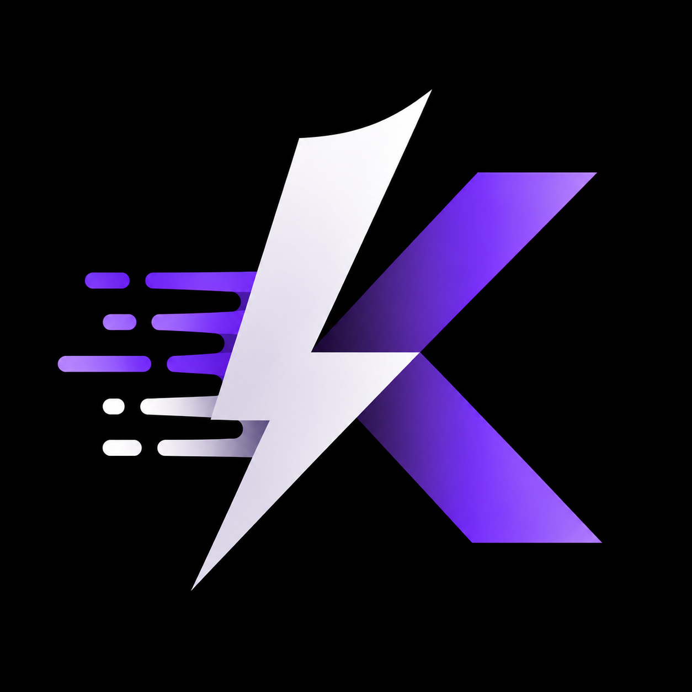

<p align="center">
  
</p>

# kiln-compiler

[](https://www.npmjs.com/package/kiln-compiler)
[](https://github.com/mohxmd/kiln/blob/main/LICENSE)
[](https://bun.sh)
[](https://nodejs.org)

**Compile modern web framework applications into single self-contained native executables via [Bun](https://bun.sh).**

> **Supported**: Next.js 15+ & 16 (App Router & Pages Router) • **Planned**: SvelteKit, React Router, TanStack Start, Astro, Nitro

---

## Features

- **100% Self-Contained Binary**: Compiles SSR code, runtime chunks, and static assets into a single native binary. No `node_modules` or Node.js runtime needed on the host.
- **Instant Cold Starts (<10ms)**: Fast-path SHA-256 build manifest check (`.kiln-extracted`) skips extraction on subsequent boots.
- **Docker Optimized**: Pre-extract assets during `docker build` using `./server --extract` for instant container startup and zero runtime disk overhead.
- **Optimized Binary Footprint**: Prunes dead build artifacts (sourcemaps, dev bundles, Webpack compiler engines) and Gzip-compresses embedded server assets.
- **Turbopack & Monorepo Ready**: Scans and rewrites 16-hex mangled Turbopack requires with runtime `Module._resolveFilename` fallback hooks supporting npm, pnpm, and Bun virtual stores.
- **Universal Architecture**: Modular `FrameworkAdapter` contract allows compiling any web framework with zero compiler core modifications.

---

## Installation

```bash
# Using bun
bun add -d kiln-compiler

# Using pnpm
pnpm add -D kiln-compiler

# Using npm
npm install -D kiln-compiler
```

---

## Quick Start (Next.js 15+ / 16)

### 1. Configure the build adapter in `next.config.ts`

```ts
import type { NextConfig } from "next";

const nextConfig: NextConfig = {
  adapterPath: import.meta.resolve("kiln-compiler"),
};

export default nextConfig;
```

### 2. Build & compile

```bash
next build && kiln -o ./bin/app
```

### 3. Run the standalone binary

```bash
./bin/app          # Starts production server on http://0.0.0.0:3000
```

---

## CLI Options

```bash
kiln [options] [-- bun-build-flags...]
```

| Flag | Default | Description |
|---|---|---|
| `-p, --project <dir>` | `.` | Project root directory containing build output |
| `-o, --out <path>` | `./server` | Output executable path (e.g. `./bin/app`) |
| `-f, --framework <name>` | *(auto-detect)* | Framework adapter to use (e.g. `next`) |
| `-t, --target <target>` | *(host platform)* | Cross-compilation target (e.g. `bun-linux-x64`, `bun-windows-x64`) |
| `--list-adapters` | | Show all registered framework adapters |
| `-h, --help` | | Show CLI help menu |

### Cross-Compilation (Build for any OS)

Compile for Linux servers or ARM architecture without Docker:

```bash
kiln -o ./server-linux   --target bun-linux-x64
kiln -o ./server-arm     --target bun-linux-arm64
kiln -o ./server-win.exe --target bun-windows-x64
```

---

## Runtime Environment Variables

| Variable | Default | Description |
|---|---|---|
| `PORT` | `3000` | Server HTTP port |
| `HOSTNAME` | `0.0.0.0` | Server bind hostname |
| `KEEP_ALIVE_TIMEOUT` | — | HTTP keep-alive timeout in milliseconds |
| `KILN_RUNTIME_DIR` | Binary directory | Runtime files extraction root (e.g. `/tmp/app` for RAM-backed tmpfs) |

---

## Docker Deployment (`--extract`)

To achieve instant sub-10ms container cold starts, pre-materialize runtime files during image build:

```dockerfile
FROM oven/bun:alpine AS runner
WORKDIR /app

# Copy the compiled standalone binary
COPY bin/app /app/app

# Pre-extract runtime files into the container layer
RUN ["/app/app", "--extract"]

EXPOSE 3000
ENV PORT=3000
CMD ["/app/app"]
```

---

## Adding a New Framework Adapter

Implement the `FrameworkAdapter` interface and register it:

```ts
import type { FrameworkAdapter } from "kiln-compiler";
import { registerAdapter } from "kiln-compiler";

const myAdapter: FrameworkAdapter = {
  framework: "my-framework",
  name: "My Framework",
  detect: (dir) => existsSync(join(dir, "my-framework.config.ts")),
  getStandaloneDir: (dir) => join(dir, "build/server"),
  getDistDir: (dir) => join(dir, "build"),
  getStaticAssetConfig: () => ({ dir: "client", urlPrefix: "/assets" }),
  getStubs: () => [],
  getBuildDefines: () => [],
  generateServerEntry: (ctx) => `/* runtime server code */`,
};

registerAdapter({ framework: "my-framework", create: () => myAdapter });
```

---

## Programmatic API

```ts
import { compileApp, compileStandalone, generateEntryPoint } from "kiln-compiler";
```

| Function | Description |
|---|---|
| `compileApp(options)` | End-to-end orchestration: detect framework -> generate entrypoint -> compile binary |
| `generateEntryPoint(options)` | Generates asset mapping manifest and server entrypoint using adapter |
| `compileStandalone(options)` | Runs `bun build --compile` against standalone entrypoint |

---

## License

[MIT](LICENSE) © [Mohamed](https://github.com/mohxmd)